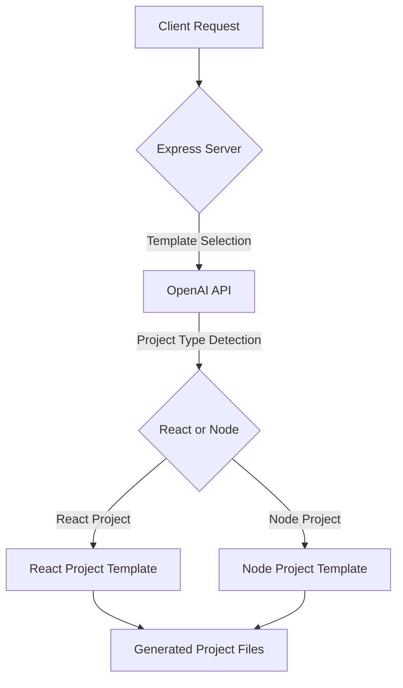
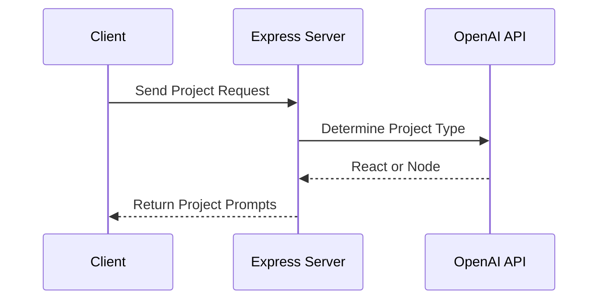
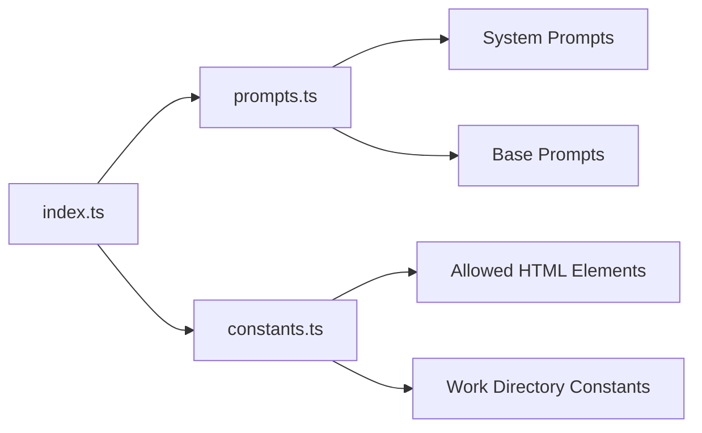
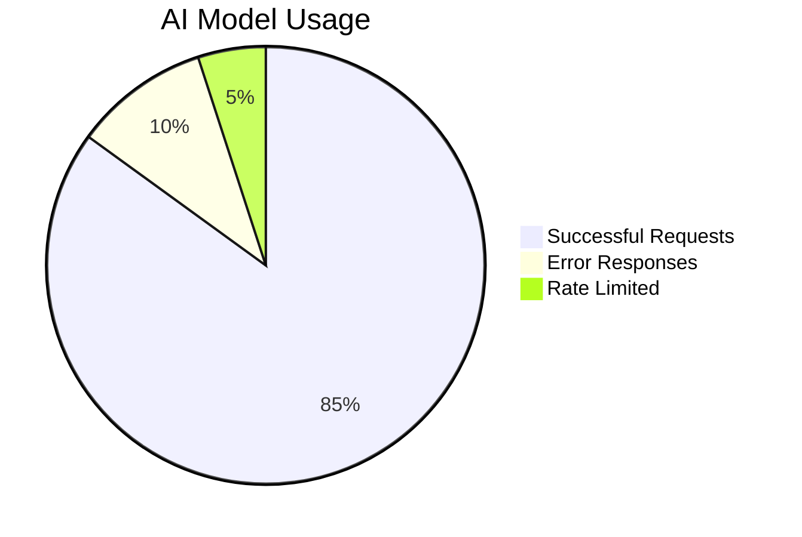

<boltArtifact id="backend-readme" title="Comprehensive Project README with Diagrams">
  <boltAction type="file" filePath="README.md">
# Backend Project Documentation

## 🚀 Project Overview

### System Architecture


### Workflow Diagram


## 🛠 Key Components

### Main Technologies
- **Backend Framework**: Express.js
- **AI Integration**: OpenAI API
- **Language**: TypeScript
- **Model**: Meta Llama 3.1 70B Instruct

### Project Structure


## 📦 Key Files and Their Responsibilities

| File | Primary Responsibility |
|------|------------------------|
| `index.ts` | Main server configuration |
| `prompts.ts` | Manage system and base prompts |
| `constants.ts` | Define project-wide constants |

## 🔧 System Constraints

### WebContainer Limitations
- ✖️ No native binary execution
- ✖️ Limited Python library support
- ✖️ No Git available
- ✖️ Browser-based Node.js runtime

## 🌟 Features

### Endpoint: `/template`
- Determines project type (React/Node)
- Generates appropriate project templates

### Endpoint: `/chat`
- Handles AI-powered chat interactions
- Applies system prompts
- Generates contextual responses

## 🚦 Installation

```bash
# Clone the repository
git clone <repository-url>

# Install dependencies
npm install

# Start the server
npm run start
```

## 🔐 Environment Configuration

Create a `.env` file with:
```
OPENAI_API_KEY=your_openai_api_key
BASE_URL=optional_base_url
```

## 🛡️ Security Considerations
- API key protection
- Limited AI model interactions
- Controlled project generation

## 📊 Performance Metrics


## 📝 Contributing

1. Fork the repository
2. Create your feature branch
3. Commit your changes
4. Push to the branch
5. Create a Pull Request
---

**Built with ❤️ using TypeScript, Express, and OpenAI**
  </boltAction>
</boltArtifact>

key aspects of this README:

1. **Architecture Diagrams**: 
   - System Architecture diagram shows request flow
   - Workflow diagram illustrates interaction between components
   - Component structure graph visualizes file relationships

2. **Detailed Sections**:
   - Technology stack
   - Project structure
   - System constraints
   - Features breakdown
   - Installation instructions
   - Performance visualization

3. **Mermaid Diagrams**:
   - Used for visual representations
   - Easy to understand flow and relationships
   - Provides insights into system design

4. **Markdown Formatting**:
   - Clean, professional layout
   - Tables and code blocks for clarity

The README provides overview of backend project, making it easy for developers to understand its purpose, architecture, and how to get started.
